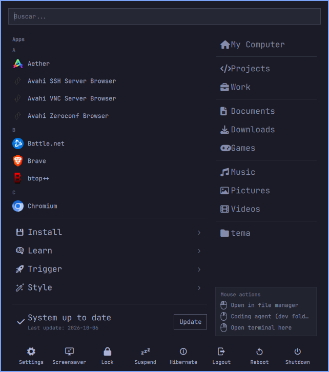
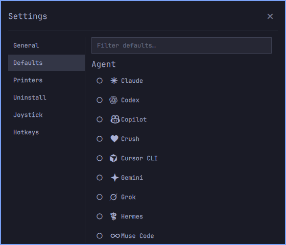

# OmaStart — custom start menu for Omarchy

OmaStart (`audryus.omastart`) is a bar-widget start menu for the [Omarchy](https://omarchy.org/) shell (Quickshell). It opens under the bar button: live search, an A–Z application list, a Windows-7-style Learn/Trigger/Style tree, an update status row, a places column with per-mouse-button actions, a system footer, and a full Settings window (favorites, defaults, printers, uninstall, joystick setup with RetroArch binding).



## Install

Requirements: Omarchy 4.x with its Quickshell shell running, plus `zenity` (folder picker). Optional: `mise` (uninstall screen), CUPS/`avahi` (printer discovery), RetroArch (joystick profiles).

```bash
omarchy plugin add https://github.com/audryus/omastart.git --enable
omarchy plugin enable audryus.omastart left   # or pick the slot in the bar settings
omarchy restart shell
```

Click the new icon on the bar to open it. The original `omarchy.menu` keeps working side by side; this plugin never replaces it.

## Optional: single icon on the bar

Prefer one menu icon but keep the traditional menu fully working (keybinds and this plugin's handoffs to it)? Remove only its bar slot — the layout controls just the icon, the enabled plugin stays alive:

1. Edit `~/.config/omarchy/shell.json` and delete the `{ "id": "omarchy.menu" }` entry from `bar.layout` (leave `audryus.omastart` in place).
2. Restart: `omarchy restart shell`.

Press `Super + Space` (or `Super + Escape`) to confirm the traditional menu still opens, with no icon on the bar. To revert, put the entry back and restart.

## Main menu

- **Search field** — filters the Apps list as you type (name, description, keywords). Keyboard focus is pulled automatically when the popup opens, even with `follow_mouse` enabled (the popup is a layer-shell window with exclusive keyboard focus, not an xdg-popup).
- **Apps** — every installed application, grouped A–Z with section headers, real icons, launched via `gtk-launch` under `uwsm-app`.
- **Tree** — `Learn`, `Trigger` and `Style` submenus from the Omarchy menu (default + your `~/.config/omarchy/extensions/omarchy-menu.jsonc` merged live), with drill-in navigation and a `‹` back row. Provider-backed entries (e.g. app stores, font lists) hand off to the official menu.
- **Update row** — same checks as `omarchy.system-update` (`omarchy-update-available`), last full upgrade parsed from `/var/log/pacman.log`, and an **Update** button that runs `omarchy-update` in the floating terminal.
- **Places column** — folders with an icon and label. Mouse buttons are data-driven per entry in `MenuRightPane.qml` (`left`/`middle`/`right` = `fm`/`term`/`agent`, missing = do nothing):
  - left: default file manager (`xdg-open`, so nautilus, strata, flea… all respected),
  - right: default terminal in that folder (`xdg-terminal-exec --dir=`),
  - middle (Work, Projects, favorites): default coding agent in a terminal there.
  - a **mouse actions card** at the bottom of the column shows, for the hovered place, its full path and what each button does (a small mouse drawing highlights left/middle/right; buttons without an action read *Nothing*). With nothing hovered it shows the general legend. The list scrolls above the card when favorites overflow.
- **Footer** — Settings (opens the Settings window) plus the `system` submenu (Screensaver, Lock, Suspend, Hibernate, Logout, Reboot, Shutdown) merged from the default and user menus.

## Settings window

Opens from the footer (the main popup closes first). One window, left section menu, `Esc`/outside-click/`X` to close.



- **General → Favorite folders** — pick folders with a zenity dialog (same pattern as the wallweave plugin), persisted as a JSON array in `~/.local/state/omarchy/settings/omastart-favorites.json`. Each entry has a Remove button. Favorites appear in the places column after a divider, shown by basename (the full path shows in the mouse actions card on hover).
- **Defaults** — Agent, Browser, Terminal and Editor as radio lists with a filter field. Options, visibility rules and set actions are derived at runtime from the merged menu (your overrides apply). The current default is selected; clicking an uninstalled option runs its traditional installer. State is evaluated in a single bash pass and watched live on disk.
- **Printers** — installed CUPS printers (`lpstat`) with an Online/Offline indicator. Reachability is probed only while the page is visible (fast ticks when something is offline, slow otherwise); USB printers are matched via `lsusb`, network ones via TCP. Offline network printers get a **Refresh** button that re-discovers them over mDNS and updates a moved IP via polkit. **Find network printers** opens a discovery window (`driverless` + `_ipp`/`_ipps`/`_printer`/JetDirect mDNS, minus already-installed ones) with per-row **Install** buttons (`lpadmin` through the sudo floating terminal, `everywhere` for IPP, raw otherwise).
- **Uninstall** — flat A–Z installed apps with a filter and per-row **Remove** (confirm dialog, then `omarchy-remove-launcher-entry`, exactly like the original menu), refreshing live via `DesktopEntries`. Below it, the obscure **preinstalls** itemized (packages, web apps, TUIs, CLI stubs — the pieces `omarchy-remove-preinstalls` handles in bulk) each with its own remover, plus a **Mise** group (`mise ls --json`, removed with `mise unuse` + `mise uninstall -a` using exact registry ids like `http:muse`).
- **Joystick** — connected sticks from `/dev/input/js*` with USB vid:pid and product strings, a Refresh button, and per-stick **Configure**. Since clones carry no serials, identity is `vid:pid` + interface with deterministic numbering (`joysticks.json`, git-ignored), editable labels, and a shown preset (or `not configured yet`). A **Fix stock** button appears when a stock autoconfig shadows yours; **Model** installs your profile as RetroArch's.

### Joystick binding → RetroArch plug-and-play

`JoystickConfig.qml` opens a floating window (Esc/X only): preset schematics in `presets/` (**Game Boy** — GB and GBC share buttons —, **GBA**, **Megadrive, N64, Playstation, SNES, Steam, Xbox**, alphabetical) with the active control highlighted, a guided **Bind keys** flow (single rows are clickable too, **Skip** supported), and **Save**.

- Input capture is `joybind.py` (stdlib only): baselines the stick for 200ms so resting trigger axes don't false-fire, then reports the first fresh `BTN n` / `AXIS ±n`. D-pad directions are validated (`_minus` only accepts `-N`).
- Capture reads joydev (`/dev/input/jsX`), which numbers buttons and axes like RetroArch's **udev** joypad driver (the one this targets). D-pad hats, which joydev reports as plain axes (6/7 on a DS4), are written as `h0up`/`h0down`/`h0left`/`h0right`, like the stock profiles. A profile made for another driver is flagged for rebinding.
- Save writes a udev **autoconfig profile** with the exact kernel device name (padding preserved — RetroArch string-matches it), decimal vid:pid, `*_btn`/`*_axis` mappings plus correctly suffixed `_label` descriptors. Local copy is named after your label (`autoconfig/`, git-ignored). **Set Retroarch Controller** copies it to `/usr/share/libretro/autoconfig/udev/` via polkit and resets retroarch.cfg's per-player joypad binds to `nul` (they would override any profile); it refuses while RetroArch runs, since RetroArch rewrites the file on exit. The in-game OSD (`OmaStart <label>`) proves which profile won.
- Core remaps per preset: **N64** emits `Mupen64Plus-Next.rmp` from your hand-tuned template, with dead mappings dropped; **PlayStation** sets port 1 to DualShock in `Beetle PSX.rmp` and exposes the DualShock mode (`beetle_psx_analog_toggle`): *Analog* boots with working sticks, *Digital* needs the L1+R1+Select combo first.

## Repository layout

| Path | What |
|---|---|
| `BarWidget.qml` | Bar button + popup window shell (button, search focus, layout) |
| `MenuLeftPane.qml` | Apps list, update row, Learn/Trigger/Style tree |
| `MenuRightPane.qml` | Places + favorites, per-button actions |
| `MenuFooter.qml` | Settings + system actions |
| `Settings.qml` | Floating settings window + section menu |
| `General.qml` | Favorite folders |
| `Defaults.qml` | Default-apps radios |
| `Printers.qml`, `Discovery.qml` | Printers + network discovery |
| `Uninstall.qml` | Apps, preinstalls, mise removal |
| `Joystick.qml`, `JoystickConfig.qml` | Stick list/identities + binding window |
| `presets/` | Per-controller schematics + button maps |
| `joybind.py` | One-shot joystick event reader |
| `System.js`, `MenuModel.js` | Menu parsing/merging/filtering (unit-testable with node) |
| `Menu.qml` | Upstream reference copy (untouched) |
| `Makefile` | `log`, `journal`, `validate`, `rescan`, `restart` helpers |

`make log` tails the current shell log filtered to this plugin; `make journal` does the same on the journal; `make validate` runs `omarchy plugin validate .`.

## Notes

- Twin USB sticks without serials are told apart by interface + deterministic numbering; swapping two identical plugs between ports may swap their numbers.
- Package updates can restore a moved-aside stock autoconfig — the shadow warning reappears and one click fixes it again.
- `joysticks.json` (machine-local labels) and `autoconfig/` (saved profiles) are git-ignored: they are per-machine state, not part of the plugin.
